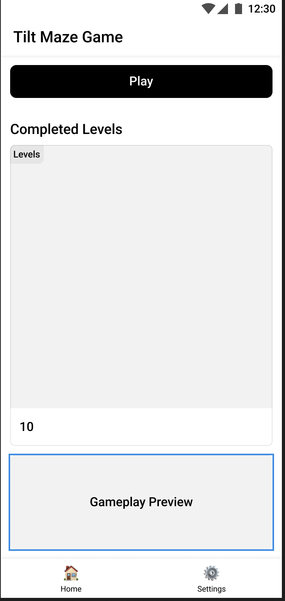
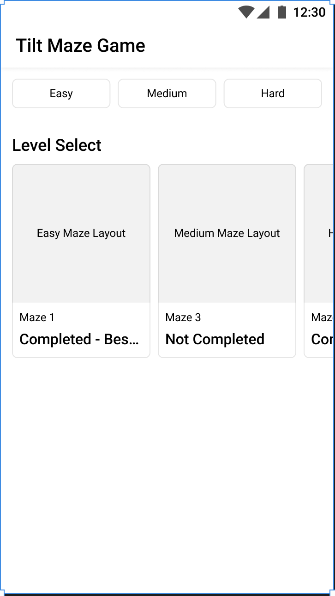
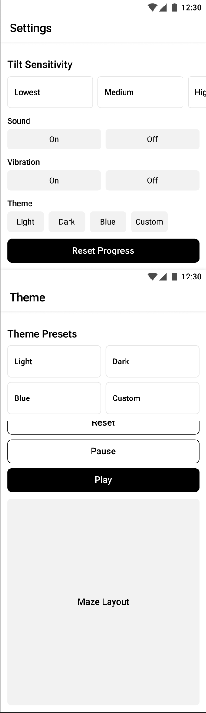

# Tilt Maze Game

A fun mobile game where you tilt your phone to roll a ball through mazes! Try to reach the goal while avoiding walls and dangerous laser gates. How many levels can you complete?

## What's This Game About?

Tilt Maze is a simple but addictive game that uses your phone's motion sensors. Just tilt your device to move the ball around - it feels super natural, like rolling a real ball! The game starts easy but gets harder as you go, with trickier mazes and laser gates that turn on and off. You'll need good timing and steady hands to get through them.

The game keeps track of your best score so you can try to beat it next time. You can also switch between light and dark themes depending on what looks best to you. The controls are easy to learn but the later levels will really test your skills!

## Game Screenshots


*The home screen where you can see your best score and start playing*


*The main game screen where you tilt to control the ball*


*Change themes and adjust game settings*

## How I Used Material Design

I built this game using Material Design to make it look modern and feel great to use. You can see this in the clean, simple layouts and the way everything has a consistent style.

The game uses cards and surfaces that appear to float above the background with subtle shadows. This creates a sense of depth that helps you understand what's important on the screen. For example, on the game over screen, the score card pops out against the darker background, making it easy to read your results. The buttons have a nice ripple effect when you tap them, giving you instant feedback that you pressed something.

Colors are another big part of Material Design in this game. I carefully picked colors that work well together and made sure text is always easy to read. The game has both light and dark themes that follow Material Design color guidelines. You'll notice that important buttons (like "Play Again") stand out with bold colors, while less important ones (like "Exit") are more subtle. This helps guide you through the game without having to think about what to do next.

## How to Play

1. Tilt your phone to move the ball
2. Try to reach the green goal area
3. Avoid walls and laser gates (they'll end your game!)
4. Complete as many levels as you can
5. Try to beat your high score!

## Cool Features

- Tilt controls that feel natural
- Mazes that get harder as you play
- Dangerous laser gates that turn on and off
- High score tracking
- Light and dark themes
- Haptic feedback when you win or lose

## Want to Try It?

```bash
git clone https://github.com/kolin-nielson/TiltMazeGame.git
cd TiltMazeGame
npm install
npm start
```

Then scan the QR code with the Expo Go app on your phone.

## Built With

- React Native
- Expo
- React Native Paper (for Material Design)
- Matter.js (for realistic physics)
