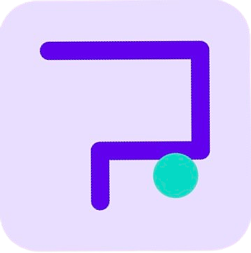

# The Tilt Maze 🎮

<p align="center">
  
</p>

<p align="center">
  <b>An addictive physics-based puzzle game that uses device tilt to navigate through challenging mazes!</b>
</p>

<p align="center">
  
</p>

## 🎯 Game Overview

**The Tilt Maze** challenges players to master the art of device tilting to guide a ball through increasingly complex mazes. Your mission is simple yet engaging: navigate from the starting point to the green goal while collecting valuable coins along the way.

As you progress, you'll face more challenging obstacles:

- **Intricate Wall Patterns** that require precise movement
- **Dynamic Laser Gates** that cycle on and off, demanding perfect timing
- **Strategic Coin Placement** that tests your skill and control

Each level completed adds to your score, with the difficulty progressively increasing to keep you challenged and engaged. Collect coins to unlock a variety of unique ball skins in the shop, adding a personalized touch to your gameplay experience.

## ✨ Key Features

### Immersive Gameplay

- **Ultra-Responsive Tilt Controls**: Finely-tuned accelerometer integration provides intuitive, precise movement
- **Realistic Physics Engine**: Powered by Matter.js for authentic ball dynamics, collisions, and momentum
- **Procedurally Generated Mazes**: Each level offers a unique challenge through algorithmic maze creation
- **Adaptive Difficulty**: The game evolves as you progress, keeping the experience fresh and challenging

### Rich Game Elements

- **Collectible Coins**: Gather coins throughout levels to unlock cosmetic items
- **Special Coins**: Discover rare, high-value coins for bigger rewards
- **Laser Gate Obstacles**: Time your movements to pass through cycling laser barriers
- **Continue Feature**: Watch a rewarded ad for a second chance after failing (limited to once per run)

### Polished User Experience

- **Smooth Animations**: Fluid transitions and effects powered by React Native Reanimated
- **Haptic Feedback**: Optional vibration effects enhance the tactile experience
- **Dynamic Lighting**: Subtle shadow effects add depth to the game world
- **Adaptive Performance**: Automatically adjusts quality settings based on device capabilities

### Customization & Progression

- **Extensive Shop**: Unlock and select from a variety of ball skins and trail effects
- **Theme Options**: Toggle between light and dark modes or use system settings
- **Sensitivity Controls**: Fine-tune tilt sensitivity to match your play style
- **High Score Tracking**: Compete against yourself to achieve new personal bests

## 🛠️ Technical Implementation

### Core Technologies

- **React Native & Expo**: Cross-platform mobile development framework
- **TypeScript**: Type-safe code for improved reliability and developer experience
- **Redux Toolkit**: Efficient state management across the application
- **Matter.js**: Advanced 2D physics engine for realistic ball movement
- **React Navigation**: Seamless screen transitions and navigation flow
- **React Native Paper**: Material Design components for a polished UI
- **AsyncStorage**: Persistent local storage for game progress and settings

### Performance Optimizations

- **Efficient Rendering**: Optimized component rendering to maintain 60fps gameplay
- **Dynamic Quality Settings**: Adjusts physics simulation fidelity based on device capabilities
- **Memory Management**: Careful resource handling to prevent leaks during extended play
- **Lazy Loading**: Components and assets loaded only when needed

### Architecture Highlights

- **Custom Physics Hook**: Specialized usePhysics hook for game mechanics
- **Sensor Integration**: Fine-tuned gyroscope and accelerometer handling
- **Component Modularity**: Clean separation of concerns for maintainability
- **Slice-based State**: Organized Redux store with focused state slices

## 📱 Installation & Development

```bash
# Clone the repository
git clone https://github.com/kolin-nielson/TiltMazeGame.git

# Navigate to project directory
cd TiltMazeGame

# Install dependencies
npm install

# Start the development server
npm start

# Run on iOS
npm run ios

# Run on Android
npm run android
```

## 📂 Project Structure

```bash
src/
├── components/       # UI components
│   ├── game/         # Game-specific components
│   ├── shop/         # Shop components
│   └── common/       # Shared UI elements
├── hooks/            # Custom React hooks
│   ├── usePhysics.ts # Physics engine integration
│   └── useSensors.ts # Device sensor handling
├── navigation/       # Navigation configuration
├── screens/          # Main application screens
├── store/            # Redux state management
│   └── slices/       # Feature-specific state slices
├── styles/           # Shared styles and themes
├── utils/            # Helper functions
│   └── mazeGenerator.ts # Procedural maze creation
└── config/           # App constants and configuration
```

## 🚀 Future Enhancements

- **Online Leaderboards**: Compare scores with players worldwide
- **Additional Game Modes**: Time trials, puzzle modes, and more
- **Level Editor**: Create and share your own maze designs
- **Achievement System**: Unlock badges for completing specific challenges
- **Social Sharing**: Share your high scores and custom levels

## 📄 License

This project is licensed under the MIT License - see the LICENSE file for details.

## 👨‍💻 About the Developer

Developed by Kolin Nielson, a passionate game developer focused on creating engaging mobile experiences that combine intuitive controls with challenging gameplay.

*All contributions welcome — please follow ESLint & Prettier guidelines.*

## License

This project is licensed under the MIT License. See [LICENSE](LICENSE) for details.
